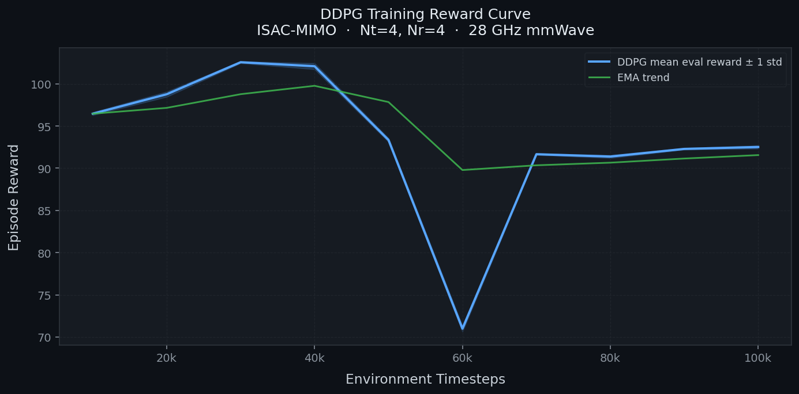
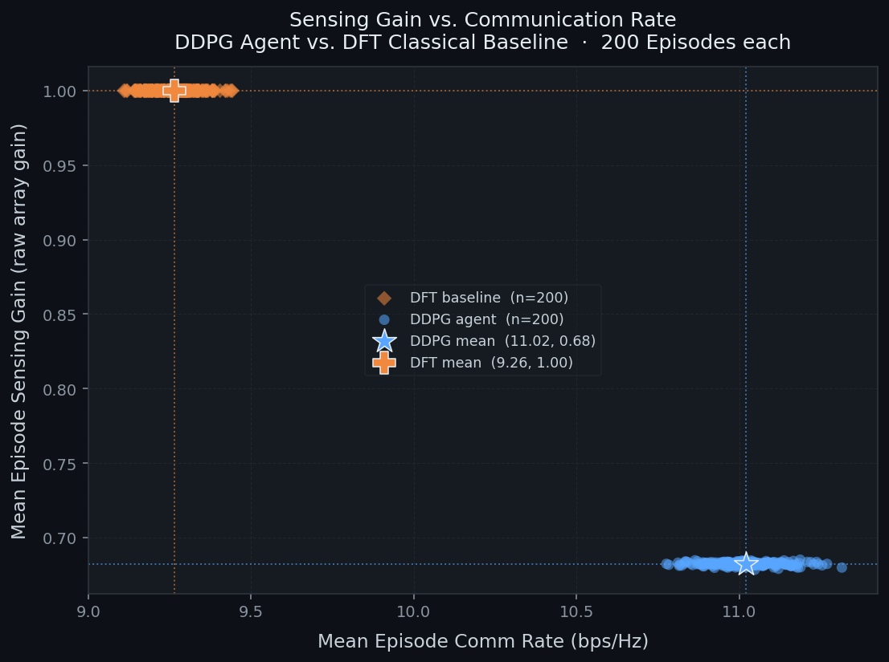
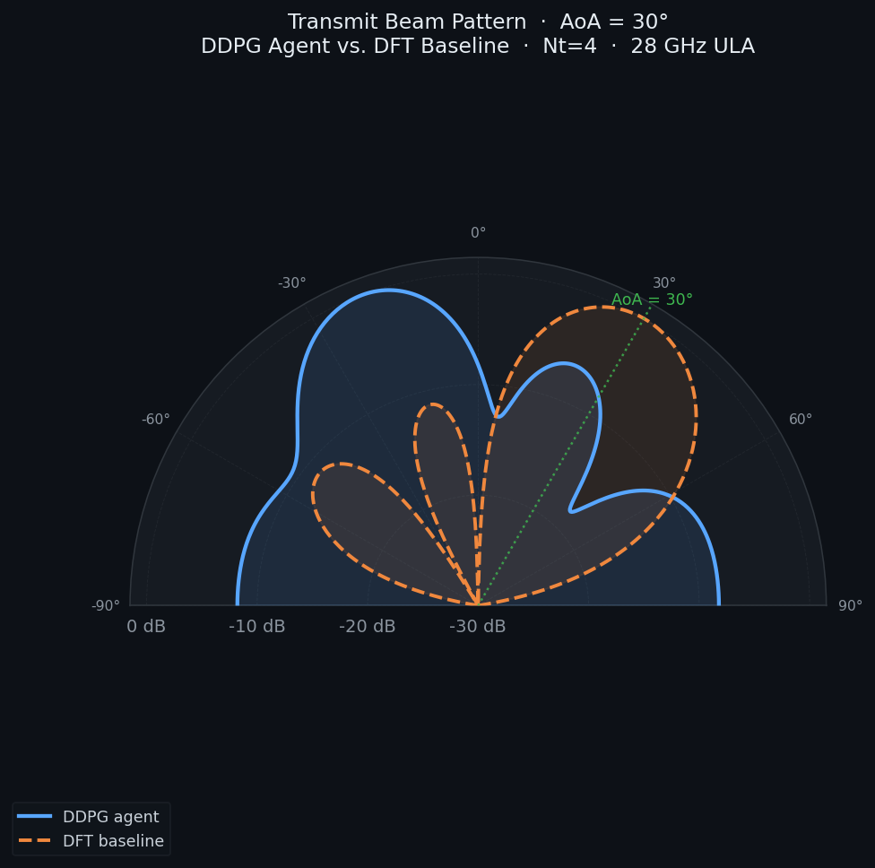
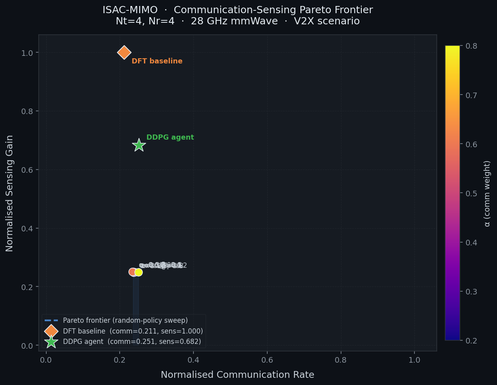

# ISAC-MIMO-DRL

Deep reinforcement learning for beamforming in mmWave ISAC (Integrated Sensing and Communication) systems. A DDPG agent learns to steer a MIMO beamformer to balance communication throughput against sensing accuracy — no closed-form solution required.


## Background

Built on two papers:

- **Lillicrap et al. (2015)** — DDPG for continuous action spaces. The policy maps raw channel observations to beamforming weights and learns the communication/sensing tradeoff end-to-end.
- **Liu et al., IEEE ComST (2022)** — ISAC survey. The Pareto curve evaluation follows their formulation of the sensing-communication tradeoff.

Channel model: Saleh-Valenzuela clustered mmWave propagation. Mobility: 3GPP Release 16 NR-V2X.

## Stack

- **DRL:** PyTorch, Stable-Baselines3, Gymnasium
- **Optimisation:** CVXPY (convex baselines)
- **Experimentation:** TensorBoard, Jupyter
- **Python:** 3.11+, uv

## Run

```bash
pip install uv
uv sync
jupyter notebook
```

See `notebooks/` for Colab training runs. For local runs:

```bash
uv run python training/classical_baseline.py   # DFT steering-vector baseline
uv run python training/train_ddpg.py           # train the DRL agent
uv run pytest -v                               # 6 tests, should all pass
```

## Project structure

```
environment/     # Gymnasium env — ISACEnv, channel model, MIMO system, V2X scenario
training/        # DDPG training, classical DFT baseline
evaluation/      # evaluation scripts, Pareto curves, plotting
models/          # saved SB3 checkpoints (gitignored)
logs/            # .npy result files and .png plots
docs/            # architecture docs, future reports
tests/           # pytest suite (channel physics, reward behavior)
```

The main components live in `environment/`:
- `isac_env.py` — the Gymnasium environment. Wraps everything.
- `mimo_system.py` — ULA steering vectors, array gain calculations
- `channel_model.py` — Saleh-Valenzuela clustered mmWave channel, supports both random and temporally coherent modes
- `v2x_scenario.py` — 1D vehicle motion model

## Reward design

The agent gets a weighted sum of two normalised terms:

- **Communication** — Shannon rate normalised by the theoretical maximum: `log2(1 + SNR) / log2(1 + SNR_max)`
- **Sensing** — squared cosine similarity between the beamforming vector `w` and the steering vector at the target AoA: `|w^H · a(AoA)|^2 / (||w||^2 · Nt)`. This is 0 when the beam misses the target and 1 when it's perfectly aligned. No calibration needed.

The balance is controlled by `alpha` and `beta` in `RewardConfig`.


| Phase | What | Status |
|-------|------|--------|
| P1 | Reward redesign, channel physics fixes, verification tests, repo cleanup | **Done** |
| P2 | 3GPP channel model, UPA support, urban/highway V2X profiles | Planned |
| P3 | PPO / SAC / TD3 benchmark suite | Planned |
| P4 | WMMSE, MMSE-ISAC baselines, Pareto analysis | Planned |
| P5 | Full write-up, ablation studies, reproducibility pack | Planned |

## Results

Trained DDPG for 100k timesteps (Nt=4, Nr=4, 28 GHz, V2X scenario), evaluated over 200 episodes against a fixed DFT steering-vector baseline. Metrics are normalised to [0, 1] (comm rate vs. its Shannon bound; sensing as squared cosine similarity to the target AoA).

| Method | Comm (norm) | Sensing (norm) | Mean reward |
|--------|-------------|----------------|-------------|
| DDPG agent | **0.251** | 0.682 | 0.467 ± 0.001 |
| DFT baseline | 0.211 | 1.000 | — |

The learned policy beats the DFT baseline on communication rate while giving up some sensing alignment — a genuine point on the sensing–communication tradeoff, learned end-to-end with no closed-form solution. (DFT is sensing-optimal by construction, hence sensing = 1.0.) Longer training and the P3 algorithm suite are expected to push the agent further along the frontier.

| Training reward | Sensing vs. comm |
|---|---|
|  |  |

| Beam pattern | Pareto frontier |
|---|---|
|  |  |

Regenerate with `evaluation/plot_results.py` and `evaluation/pareto_curve.py` after training.


## References

- Lillicrap et al. *Continuous control with deep reinforcement learning*. arXiv:1509.02971, 2015.
- Liu et al. *A survey on fundamental limits of integrated sensing and communication*. IEEE Commun. Surv. Tutor., 2022.
- Saleh & Valenzuela. *A statistical model for indoor multipath propagation*. IEEE JSAC, 1987.
- 3GPP TR 37.885 — *Study on NR V2X*, Release 16.
- Wymeersch et al. *Integration of communication and sensing in 6G*. IEEE ComMag, 2021.
